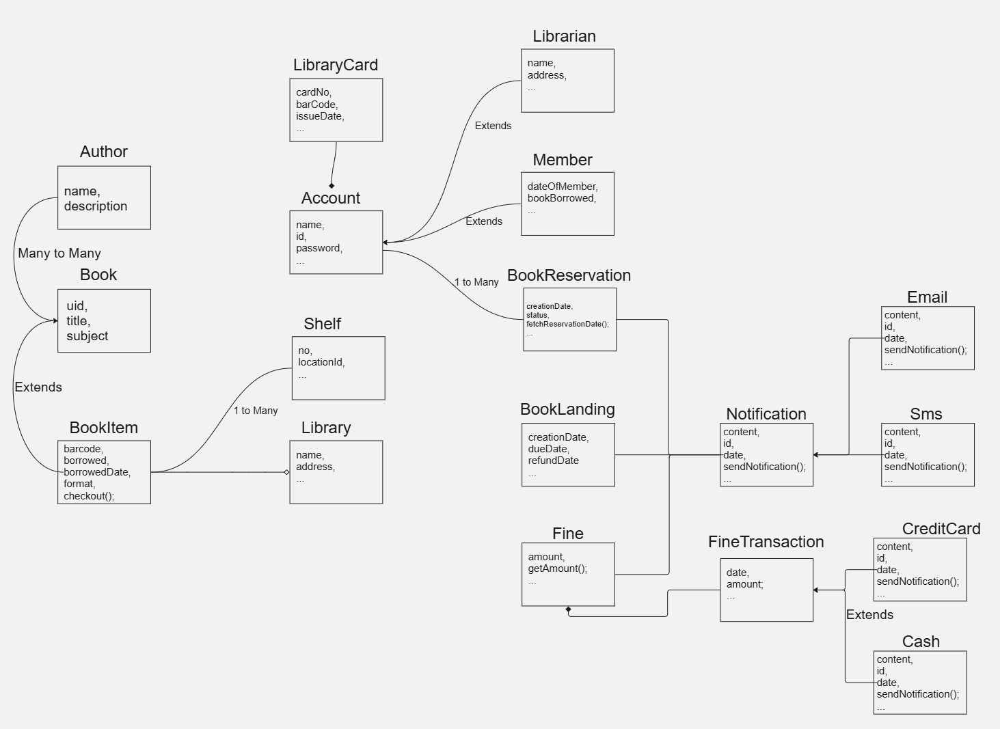
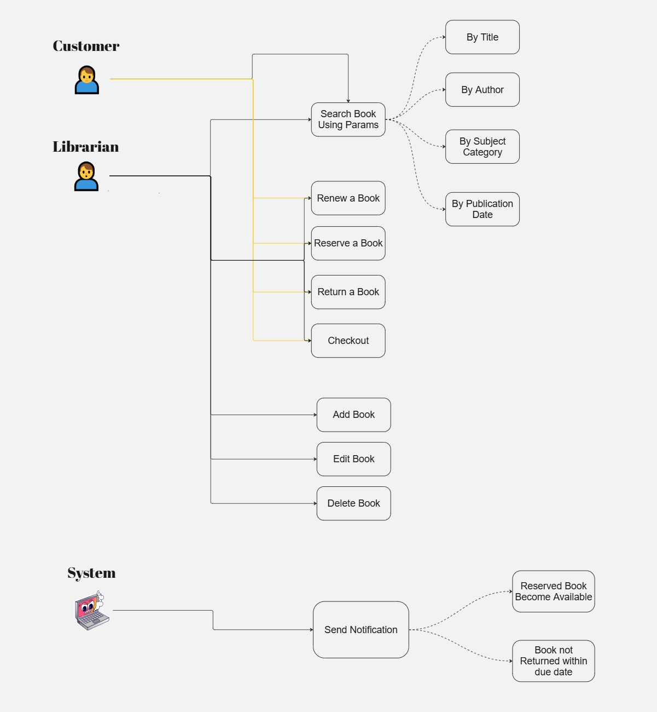
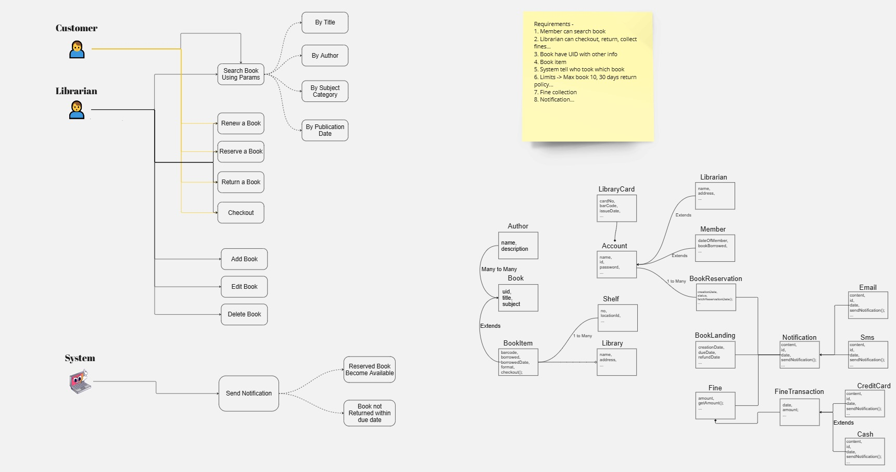

# Library Management System

The **Library Management System** is a software that manages books, members, librarians, and transactions in a library. It includes book searching, issuing, returning, and fine management.

## 📌 Features
- Manage **Books & Shelves** 📚
- Members can **borrow/return books** 🔄
- Librarians can **add/remove books & issue fines** 💳
- Supports **cash & credit card payments** 💰
- Library **notifications & book reservations** 🔔

## 📌 Class Diagram
Here is an overview of the **Library Management System** Class Diagram:

## 📌 Use Case Diagram
Here is an overview of the **Library Management System** Use Case Diagram:

## 📌 OverAll

